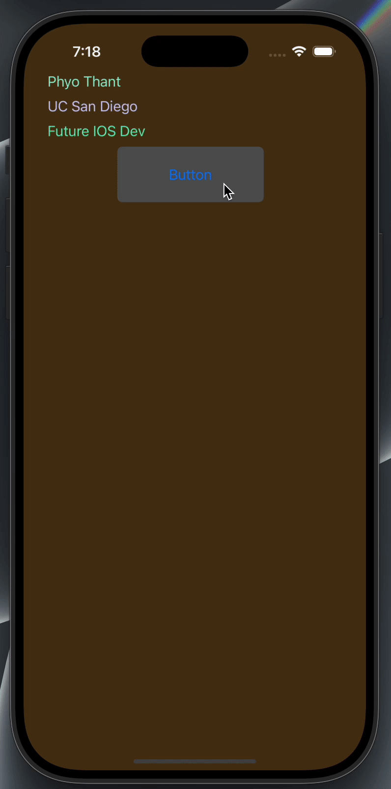

# Prework - ColorChanger

Submitted by: **Phyo Thant**

**ColorChanger** is an app that displays three labels with personal info and allows users to change the background and label text colors by tapping a button.

Time spent: **3** hours spent in total

## Required Features

The following **required** functionality is completed:

- [x] Users are see a screen with three labels and a button
- [x] Tapping the button changes the screen color to a random color

## Video Walkthrough

## App Brainstorming (Step 4)

### Favorite Apps:

- **Instagram**
  - Smooth transitions and interactive UI
  - Minimalist aesthetic
- **Spotify**
  - Seamless playlist switching
  - Custom recommendations
- **Notion**
  - Flexible block editing system
  - Clean and distraction-free workspace

### App Idea:

I'd like to build a minimalist **habit tracker app** that encourages users to build daily habits through simple check-ins, animated feedback, and motivational quotes. The app would use local notifications to remind users and visually represent progress with calming visuals.

## Notes

- I initially had a crash due to a broken button connection (`unrecognized selector sent to instance`) because the method signature changed but was still linked in Interface Builder. After removing the old connection in the Connections Inspector, everything worked perfectly.
- I also had trouble reopening the Assistant Editor initially, which was solved by restarting Xcode.

## License

    Copyright [2025] [Phyo Thant]

    Licensed under the Apache License, Version 2.0 (the "License");
    you may not use this file except in compliance with the License.
    You may obtain a copy of the License at

        http://www.apache.org/licenses/LICENSE-2.0

    Unless required by applicable law or agreed to in writing, software
    distributed under the License is distributed on an "AS IS" BASIS,
    WITHOUT WARRANTIES OR CONDITIONS OF ANY KIND, either express or implied.
    See the License for the specific language governing permissions and
    limitations under the License.
